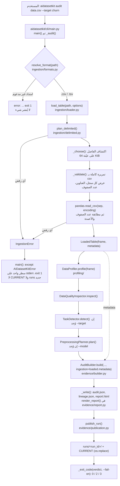
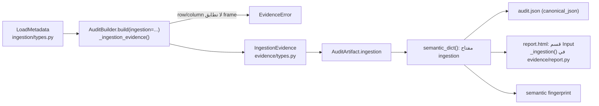
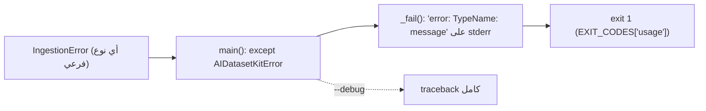

# رحلة الكود في AIDatasetKit: من الملف إلى الدليل

وثيقة حيّة تتبع البيانات عبر الكود الحقيقي، ملفاً ملفاً ودالةً دالة. تُحدَّث مع كل
موجة تغيّر هذا المسار. أسماء الملفات والدوال والرموز تُكتب بالإنجليزية كما هي في
الكود.

## 1. الصورة الكاملة

## 2. الدخول: `aidatasetkit/cli/main.py`

- `build_parser()` يعرّف الأمر `audit` ومعاملاته. أُضيف في G1-W1:
  - `--encoding` واختياراته هي `SUPPORTED_ENCODINGS` نفسها: `utf-8` (الافتراضي)،
    `utf-8-sig`، `latin-1`، `cp1256`.
  - `--delimiter` واختياراته `,` `;` `|` `tab`؛ تُحوَّل `tab` إلى `"\t"` عبر
    `_DELIMITER_CHOICES`، لأن كتابة محرف tab في سطر الأوامر غير عملية.
- `_audit(args)` يفحص وجود الملف ثم يستدعي `resolve_format(path)` **قبل** استيراد
  pandas وscikit-learn، حتى يكون رفض الامتداد فورياً.
- ثم ينادي `load_table(path, options=LoadOptions(...))`. لم يعد في الـ CLI أي
  `pd.read_csv` ولا فحص خاص للعناوين المكررة؛ كلاهما انتقل إلى ingestion.

## 3. سلطة القراءة الوحيدة: `aidatasetkit/ingestion/`

| الملف | ما فيه |
|---|---|
| `types.py` | `LoadOptions` (مُتحقَّق منه عند الإنشاء)، `LoadMetadata`، `LoadedTable`، `SourceKind`، `TableFormat`، `DelimiterSource`، `SUPPORTED_DELIMITERS`، `SUPPORTED_ENCODINGS` |
| `formats.py` | `resolve_format(path)`: `.csv` ← CSV، `.tsv` ← TSV، وغير ذلك `UnsupportedFormatError` (بما فيها `.txt`) |
| `delimited.py` | `plan_delimited()`، `_choose()`، `_shape()`، `_validate()` |
| `loader.py` | `load_table()` و`_from_file()` و`_from_dataframe()` و`_from_records()` |

الأخطاء كلها في `aidatasetkit/core/exceptions.py` تحت `IngestionError`، وهو فرع من
`AIDatasetKitError`.

### 3.1 `load_table(source, *, options=None)`

يوزّع حسب نوع المصدر:

- `pandas.DataFrame` ← `_from_dataframe`: يرفض الإطار الفارغ (`EmptyInputError`)
  والأعمدة المكررة (`DuplicateHeadersError`)، ويعيد **الكائن نفسه** دون نسخ أو
  تعديل، ولا يُجري أي profiling. خيارات الملفات (encoding/delimiter) مرفوضة هنا.
- `str` أو `bytes` ← `UnsupportedFormatError`: النص قد يكون مساراً أو محتوى أو
  رابطاً، ولا نخمّن؛ المطلوب `pathlib.Path`.
- `os.PathLike` ← `_from_file`.
- `list` أو `tuple` ← `_from_records`: كل عنصر يجب أن يكون `Mapping` بمفاتيح نصية؛
  الأعمدة هي اتحاد المفاتيح بترتيب أول ظهور؛ المفتاح الغائب خلية ناقصة، ويُسجَّل
  تحذير بعدد السجلات الناقصة.
- غير ذلك ← `UnsupportedFormatError`.

### 3.2 قراءة ملف: ثلاث خطوات، كل منها ترفض ولا تُصلح

1. **الفحص الأولي** في `plan_delimited`: ملف 0 بايت ← `EmptyInputError`؛ وجود
   بايت NUL في أول 64 KiB ← `MalformedInputError` (محتوى ثنائي أو UTF-16)؛ علامة
   BOM مع `utf-8` ← تُقرأ كـ `utf-8-sig` مع تحذير.
2. **الاكتشاف** في `_choose` (إلا إذا حُدِّد الفاصل): تُقرأ أول `SAMPLE_CHARS = 64 KiB`
   وتُحلَّل بـ `csv.reader(strict=True)` مرة لكل فاصل من `, ; \t |`، فالفاصل داخل
   علامات الاقتباس قيمة لا فاصل. الفاصل يتأهل إذا أعطى كل سجل العدد نفسه من
   الحقول (2 فأكثر).
   - مؤهَّل واحد ← يُستخدم (`detected`).
   - أكثر من مؤهَّل ← `AmbiguousDelimiterError` مع عدد الأعمدة لكل مرشح.
   - كل السجلات حقل واحد ← جدول بعمود واحد مع تحذير، و`delimiter = None` في البيانات الوصفية.
   - فاصل محدَّد صراحة لا يظهر في الملف بينما فاصل آخر يقسمه باتساق ← `MalformedInputError`.
   - ملف `.tsv` مفصول بفاصلة ← `MalformedInputError`.
3. **التحقق** في `_validate`: تمريرة كاملة متدفقة بـ `csv` بذاكرة ثابتة: كل سجل
   يجب أن يطابق عرض السجل الأول (pandas يملأ الصف القصير بـ NaN بصمت، ونحن نرفضه)،
   والعناوين المكررة تُكتشف هنا قبل أن يعيد pandas تسميتها `a.1`، والملف الذي فيه
   عنوان فقط ← `EmptyInputError`. أي بايت لا يُفك ← `EncodingError` وليس
   `UnicodeDecodeError`.
4. **التحليل**: `pd.read_csv(path, sep=..., encoding=...)` مرة واحدة، ثم مقارنة
   عدد الصفوف والأعمدة بما عدّته خطوة التحقق؛ أي اختلاف ← `MalformedInputError`.

الكلفة: تمريرتان كاملتان (التحقق وpandas) زائد عيّنة محدودة. لا توجد حدود لحجم
الملف بعد، والجدول يُحمَّل كاملاً في الذاكرة.

## 4. الاستهلاك: profiling ثم quality ثم preprocessing

بعد `load_table` يعمل `_audit` على `loaded.frame` كما كان يعمل على ناتج
`pd.read_csv` سابقاً:

- `DataProfiler(kit_config).profile(frame)` في `aidatasetkit/profiling/`.
- `DataQualityInspector(kit_config).inspect(...)`.
- `TaskDetector(kit_config).detect(...)` إذا مُرِّر `--target`.
- `PreprocessingPlanner().plan(...)` ثم `PreprocessorBuilder().build(...)` إذا مُرِّر `--model`.

لا يعرف أيٌّ من هذه الطبقات شيئاً عن الملف أو الترميز أو الفاصل؛ هذا مقصود.
حدود الطبقات يفرضها `tests/integration/test_architecture_boundaries.py`، وفيه
`"ingestion": 1` في الطبقة نفسها مع `datasets`.

## 5. الدليل: من `LoadMetadata` إلى `audit.json` و`report.html`

- الحقول: `source_kind`, `format`, `encoding`, `delimiter`, `delimiter_source`,
  `header`, `row_count`, `column_count`, `memory_bytes`, `warnings`. ما لا ينطبق
  يُكتب `null` ولا يُختلق. لا مسار مطلق ولا قيمة خلية.
- إذا بُني الإطار بيد المستدعي دون `load_table`، فالقيمة `"ingestion": null`.
- إضافة المفتاح غيّرت الـ semantic fingerprint من `0f0fd1d5…` إلى `00783893…`، ثم
  رفع `schema_version` إلى `1.1` غيّرها إلى `3e93dd5e…`. الخطوتان مسجلتان
  منفصلتين في `tests/unit/test_capability_fingerprint_migration.py`: إعادة الإصدار
  إلى `1.0` تعيد البصمة الوسيطة، ثم حذف المفتاح يعيد بصمة ما قبل G1-W1.

### 5.1 أربعة أرقام مختلفة، لا يُستنتج أحدها من الآخر

| المعرّف | أين | ماذا يصف | متى يتغير |
|---|---|---|---|
| **artifact schema version** | `ARTIFACT_SCHEMA_VERSION` في `evidence/types.py`؛ `schema_version` في `audit.json` و`lineage.json` | شكل السجل ومعنى حقوله | عند إضافة حقل أو حذفه أو تغيير معناه: إضافي ← minor (`1.0` ← `1.1`)، وغير ذلك ← major. |
| **publication schema version** | `PUBLICATION_SCHEMA_VERSION` في `evidence/publication.py`؛ في `CURRENT` و`manifest.json` | تخطيط النشر: `runs/<run_id>/`، `manifest.json`، `CURRENT` | عند تغيّر التخطيط فقط. بقي `1.0` في G1-W1 لأن التخطيط لم يتغير. |
| **package version** | `pyproject.toml` ← `aidatasetkit.__version__` | إصدار المكتبة (`0.1.0a1`) | عند الإصدار. لا علاقة له بالاثنين السابقين، واختبار `test_the_artifact_schema_is_versioned_separately` يمنع خلطهما. |
| **semantic fingerprint** | `provenance.semantic_fingerprint` في `audit.json` | بصمة `semantic_dict()`: الأدلة نفسها دون الوقت والبيئة | عند تغيّر أي شيء في السجل، بما فيه `schema_version`. البصمة تقول *أن* السجل تغيّر، والإصدار يقول *أي عقد* يتبع. |

**الدرس من G1-W1:** أُضيف `ingestion` أولاً وبقي الإصدار `1.0` (`main` = `90ecfae`)،
فكان السجل الجديد لا يُميَّز عن القديم إلا بمقارنة البصمات، وهذا خلاف العقد. صُحح
إلى `1.1` في موجة إغلاق مستقلة، وبقيت الخطوة الوسيطة مسجلة ولم تُمحَ.

## 6. الخطأ: من الاستثناء إلى رمز الخروج

لأن `load_table` يُستدعى قبل `_write()`، فالرفض لا يترك `CURRENT` ولا مجلداً في
`runs/`، والتشغيل السابق الناجح يبقى كما هو. هذا تختبره
`tests/integration/test_cli_ingestion.py::TestRefusalsPublishNothing`.

| الخطأ | متى |
|---|---|
| `UnsupportedFormatError` | امتداد غير `.csv`/`.tsv`، أو نص بدل `Path`، أو نوع مصدر آخر |
| `InputNotFoundError` | المسار غير موجود أو ليس ملفاً عادياً |
| `InvalidIngestionOptionsError` | ترميز أو فاصل أو header غير مدعوم |
| `EmptyInputError` | 0 بايت، مسافات فقط، عنوان بلا صفوف، إطار أو سجلات فارغة |
| `EncodingError` | بايت لا يُفك بالترميز المطلوب |
| `MalformedInputError` | اقتباس مكسور، عدد حقول غير متسق، محتوى ثنائي، فاصل صريح خاطئ، سجل ليس Mapping |
| `AmbiguousDelimiterError` | الملف متسق تحت أكثر من فاصل |
| `DuplicateHeadersError` | عناوين أعمدة مكررة |

## 7. خارج النطاق حالياً

لم يُنفَّذ بعد، ولا يوجد له كود: اكتشاف الترميز تلقائياً، حدود الموارد وحجم
الإدخال، استنتاج التواريخ، القراءة المجزأة (chunking)، JSON/JSONL، Parquet/Feather،
XLS/XLSX، قواعد البيانات، XML/YAML، الروابط والتنزيل عبر HTTP. الواجهة
`AIDataFacade.load()` لم تُوسَّع في هذه الموجة.

## الحالة حسب الإصدار

| الإصدار / الموجة | ما يصفه هذا المستند |
|---|---|
| G0.1 (main `69303b35e30c8dda1b51490360e65bc22ff920ed`) | الـ CLI يقرأ CSV بـ `pd.read_csv(path)` الافتراضي: ملف مفصول بـ `;` يُقرأ عموداً واحداً بصمت (P0-2). |
| G1-W1 (main `90ecfae778a5983d03f4b4fa664327c62b92cff0`) | كل ما في هذا المستند، لكن `schema_version` = `1.0` رغم وجود `ingestion`. commits التنفيذ: `5759522` العقود، `b8065c3` الاكتشاف والتحقق، `6353985` الدليل، `ed91a89` الـ CLI، `2c46646` التحقق من الفاصل الصريح. |
| G1-W1 closure (فرع `g1-w1-schema-closure`) | `schema_version` = `1.1`. لا تغيير في سلوك القراءة. الـ SHA النهائي على main مسجل في ملحق `docs/evidence/G1_W1_INGESTION_FOUNDATION_REPORT.md`. |
| G1-W2 وما بعدها | غير مصرح بها بعد. |
